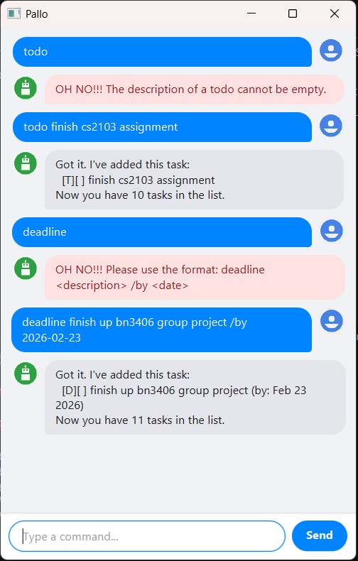

# Pallo User Guide



Pallo is a task management chatbot that helps you keep track of your todos, deadlines, and events. It features a clean GUI and saves your tasks automatically between sessions.

## Quick Start

1. Ensure you have Java 17 or above installed.
2. Download the latest `.jar` file from the [Releases](../../releases) page.
3. Run the app with `java -jar pallo.jar`.
4. Type a command in the input box and press Enter or click **Send**.

## Features

### Adding a todo: `todo`

Adds a task with no date attached.

Format: `todo DESCRIPTION`

Example: `todo finish cs2103 assignment`

```
Got it. I've added this task:
  [T][ ] finish cs2103 assignment
Now you have 3 tasks in the list.
```

### Adding a deadline: `deadline`

Adds a task with a due date.

Format: `deadline DESCRIPTION /by DATE`

Example: `deadline finish up bn3406 group project /by 2026-02-23`

```
Got it. I've added this task:
  [D][ ] finish up bn3406 group project (by: Feb 23 2026)
Now you have 4 tasks in the list.
```

### Adding an event: `event`

Adds a task with a start and end date.

Format: `event DESCRIPTION /from DATE /to DATE`

Example: `event team meeting /from 2026-02-20 1400 /to 2026-02-20 1600`

```
Got it. I've added this task:
  [E][ ] team meeting (from: Feb 20 2026 2:00 PM to: Feb 20 2026 4:00 PM)
Now you have 5 tasks in the list.
```

### Listing all tasks: `list`

Shows all tasks in your list.

Format: `list`

### Marking a task as done: `mark`

Marks the specified task as completed.

Format: `mark TASK_NUMBER`

Example: `mark 2`

```
Nice! I've marked this task as done:
  [T][X] read book
```

### Unmarking a task: `unmark`

Marks the specified task as not done.

Format: `unmark TASK_NUMBER`

Example: `unmark 2`

```
OK, I've marked this task as not done yet:
  [T][ ] read book
```

### Deleting a task: `delete`

Removes the specified task from the list.

Format: `delete TASK_NUMBER`

Example: `delete 3`

```
Noted. I've removed this task:
  [D][ ] return book (by: Jun 06 2025)
Now you have 4 tasks in the list.
```

### Finding tasks by keyword: `find`

Searches for tasks whose descriptions contain the given keyword (case-insensitive).

Format: `find KEYWORD`

Example: `find book`

```
Here are the matching tasks in your list:
1.[T][ ] read book
2.[D][ ] return book (by: Jun 06 2025)
```

### Viewing upcoming reminders: `remind`

Shows all deadlines and events coming up in the next 7 days.

Format: `remind`

### Exiting the app: `bye`

Saves your tasks and exits the application.

Format: `bye`

## Date Formats

Pallo accepts the following date formats:

| Format | Example |
|---|---|
| `yyyy-MM-dd` | `2026-02-20` |
| `yyyy-MM-dd HHmm` | `2026-02-20 1800` |
| `yyyy-MM-dd HH:mm` | `2026-02-20 18:00` |
| `dd/MM/yyyy` | `20/02/2026` |
| `dd/MM/yyyy HHmm` | `20/02/2026 1800` |

## Data Storage

Tasks are saved automatically to `data/pallo.txt` in the same directory as the app. There is no need to save manually.
